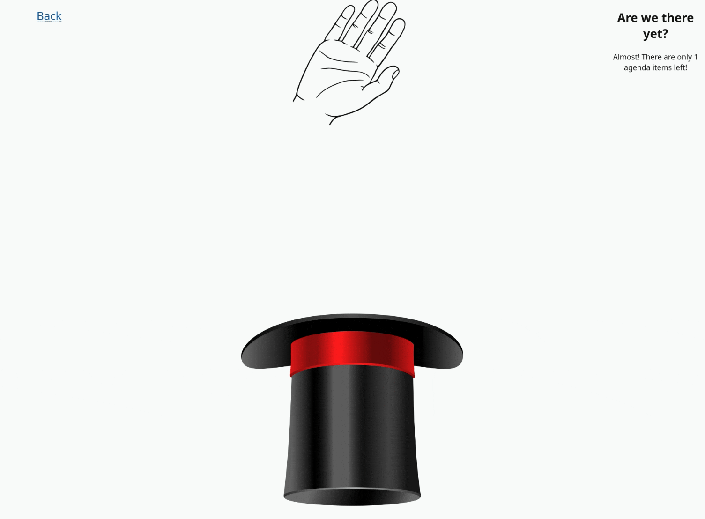
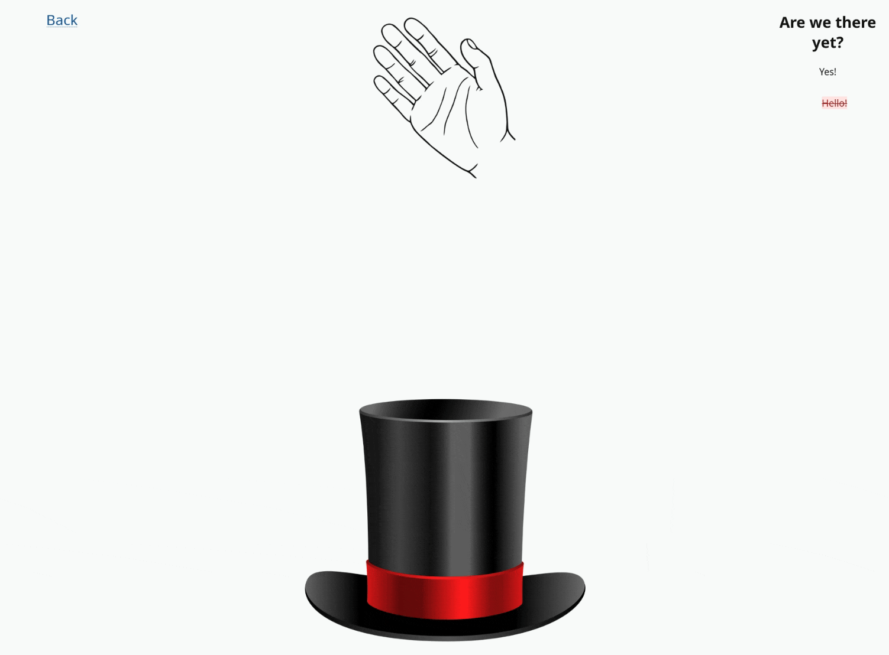

# Agenda Hat

## What is this?
The Agenda Hat is a magical (digital) creature which randomizes your meeting's agenda items, providing a focus for your meeting by reducing tangents and crosstalk.
## How do I use it?
### Setup
1. Download `docker-compose.yml.example` and rename it to `docker-compose.yml`.
2. Edit `docker-compose.yml` based on your opinions. Note that the example *will work without modification*.
3. Run the server with `docker compose up`, adding `-d` as appropriate.
### Usage
> [!Note]
> These directions assume you're using the example `docker-compose.yml` unedited. You'll have to modify the address/port number if you changed network settings from the defaults.
1. Navigate to http://localhost:8000 in your web browser.
2. Create a new meeting. Give it a name and a date.
> [!Note]
> If the meeting you're setting up is of the recurring variety, I recommend adding the next few occurrences up front and keeping a few future occurrences in the system at any given time. The reason for this advice will become clear in step 7.
3. Once you have a meeting, add some agenda items using the applicable button and form.
4. When your agenda items are all added and you're ready to start, summon the magical Agenda Hat with the "Hat Time" button.
5. The Agenda Hat will descend from its home in the (local) clouds, with its sidekick the Hand of Agenda Justice delicately selecting an agenda item for your consideration.
6. Once you're finished considering that agenda item, click "Finish Item" to vanquish it to the sidebar and direct the Hand of Agenda Justice to select a new one.
7. If you decide that the time is not right to consider the selected agenda item, you may click "Table Item" to postpone its consideration to another meeting. You will be presented with a list of other possible meetings to which to transfer the current item.
> [!Note]
> See, I *told you* the reason would become clear in step 7.
>
> Note that tabled items will be removed from the current meeting and moved wholesale to the selected meeting. The world will reflect a new reality, one in which you never made the foolish decision to bring those items up before their time.
>
> But the Agenda Hat will remember*.
8. As you proceed with your meeting, the Agenda Hat will keep you going with words of "encouragement" in its sidebar on your right.
9. Once you've finished your last agenda item, the Agenda Hat and the Hand of Agenda Justice will join together in a celebration of your triumph, until you close the browser tab and send them (temporarily, they hope) back to their home in the (local) clouds.

*it won't, really.
